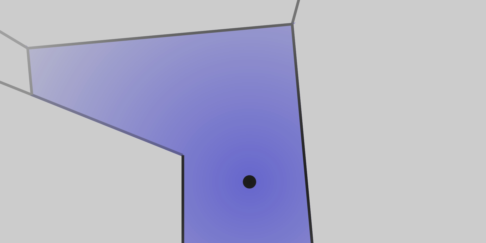

floor
=====

*Navigating non-euclidian space*

## Setup

Start by installing packages:

    npm install

## Build

Compile bundle into `dist` folder:

    npm run build

## Usage

Drag to move around, or use arrow keys.

Try different scenes by replacing `planCurl` in `setup.ts`.

## Development

    npm start

or

    npm run watch

