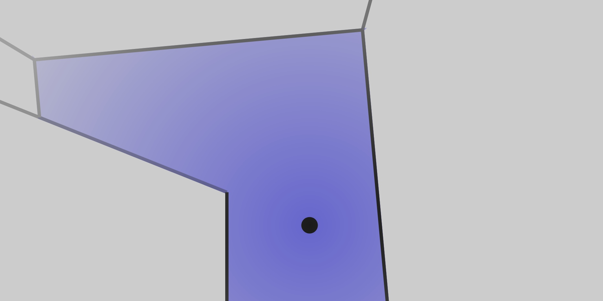

floor
=====

*Navigating non-euclidian space*



## Install

```bash
npm install
```

## Development

Start the dev server:

```bash
npm run dev
```

Rebuild on file changes without the dev server:

```bash
npm run watch
```

## Build

Compile the app into `dist/`:

```bash
npm run build
```

## Checks

Run the local checks:

```bash
npm run check
```

Or run them individually:

```bash
npm run test
npm run lint
npm run typecheck
```

## Usage

## Controls

### Movement

- `ArrowUp` or `W`: move forward
- `ArrowDown` or `S`: move backward
- `A`: move left
- `D`: move right
- `ArrowLeft` or `Q`: turn left
- `ArrowRight` or `E`: turn right
- drag with the mouse: move by dragging the view

### Navigation Tuning

- `0`: decrease warp
- `9`: increase warp
- `8`: zoom in
- `7`: zoom out
- `6`: increase local scene scale
- `5`: decrease local scene scale

`warp`, `zoom`, and `scene scale` affect slightly different parts of the rendering:

- `warp` changes the canvas projection range
- `zoom` changes the canvas zoom factor
- `scene scale` changes the avatar's local scale inside the current tile system

The movement model is intentionally non-Euclidean, so turning and wrapping may feel unusual at first.

### Debug Toggle

- `X`: toggle debug overlays

## License

[MIT](LICENSE.txt)
